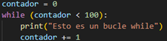
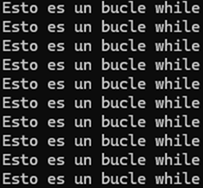
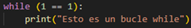
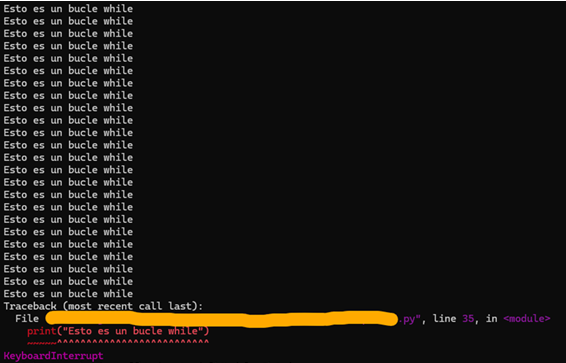
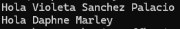
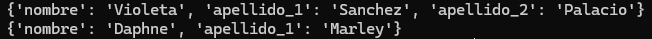

# Introducción al mundo del desarrollo

El material a continuación servirá para conocer conceptos del mundo de la programación. Este documento cuenta con explicaciones de los conceptos, ejemplos que pueden ser copiados, cambiados y ejecutados en una terminal de Python e imágenes que harán este proceso de aprendizaje algo mucho menos intimidante de lo que puede parecer a primera vista.

## 1) ¿Qué es un condicional?
Un condicional es un segmento de código Python que le permite al programa tomar diferentes acciones según la condición que impongamos.
No querremos que todos los programas se ejecuten siempre de la misma manera una y otra y otra vez. El condicional es lo que nos permite discriminar la ejecución de nuestro código, cosa que es muy útil por ejemplo cuando queremos tener opciones para usuarios administradores pero no queremos que esas opciones estén disponibles para todos los usuarios.

Para usar condicionales el código tendrá la siguiente forma:

    if (condición):
        {código que ejecutamos si la condición se cumple}

Además de esto, podemos usar else para decirle al programa que queremos ejecutar otro segmento de código si es que la conclusión no llega a cumplirse. 

    if (condición):
        {código que ejecutamos si la condición se cumple}
    else:
        {código que se ejecuta si la condición no se cumple}

Es posible, incluso, combinar estos dos comportamientos. Juntando if y else en elif podemos hacer que nuestro programa compruebe una condición, que ésta no se cumpla, y aún así podemos comprobar otra condición distinta a continuación de la siguiente forma: 

    if (condición):
        {código que ejecutamos si la condición se cumple}
    elif (segunda condición):
        {código que se ejecuta si la primera condición no se cumple y la segunda sí se cumple}
        
Un segmento de código que nos podemos encontrar podría ser:

    user = "usuario"
    if user == "admin":
        print("El usuario es admin.")
    else:
        print("El usuario no es admin.")

## 2) ¿Cuáles son los diferentes tipos de bucles en Python? ¿Por qué son útiles?
Los bucles nos permiten iterar a lo largo de los ítems de nuestro código. Podemos iterar sobre listas, rangos, tuplas, diccionarios, etc.

Hay dos tipos de bucles: los bucles for-in y los bucles while. Los bucles for-in son los que más nos encontraremos y usaremos. Este tipo de bucle itera un número de veces igual a la cantidad de cosas que contenga el ítem sobre el que trabajemos. Por ejemplo, si tenemos la siguiente lista de animales que veremos a continuación, podemos crear un bucle for-in que printe por pantalla cada uno de los ítems. 
   
    animales = ["Cats", "Crocs", "Snakes", "Birds"]
    for animal in animales:
        print({animal})

El resultado de este segmento de código es el siguiente:

Los bucles while son bucles que nos encontraremos mucho menos que los bucles for-in, pero también son bucles que querremos conocer. Este tipo de bucle, salvo que le digamos lo contrario, continuará permanentemente. Esto no es ideal, ya que no podemos ejecutar más partes del código y en algún momento el dispositivo ejecutando este programa dará errores. Para evitar este comportamiento no deseado en los bucles while usaremos una condición que vaya a dejar de cumplirse en algún momento y que nos permita salir del bucle y continuar con la ejecución del software.

Ésta es una buena forma de usar los bucles while puesto que hay un final:

   
Esta es una forma de hacer qye los bucles while causen problemas ya que el bucle nunca se detendrá:

## 3) ¿Qué es una lista por comprensión en Python?
Una lista por comprensión es una colección de bucles for-in y de condicionales que se pueden colocar en una única línea de código. El funcionamiento de la lista por comprensión es exactamente el mismo que obtendríamos si escribiéramos ese código en múltiples líneas, de modo que no estamos perdiendo datos de ninguna manera.

Por ejemplo, si tuviéramos una lista de los números del uno al seis y quisiéramos sumarle uno a todos, si no usamos una lista por comprensión el código podría ser el siguiente:

    numbers = [1,2,3,4,5,6]
    print(numbers)
    for num in numbers:
        print(num+1)

Esto sacaría por pantalla el siguiente resultado:

Sin embargo, si usamos una lista por comprensión, el código sería el siguiente:

    numbers = [1,2,3,4,5,6]
    result = [num+1 for num in numbers]
    print(result)

Y el resultado del código:

 

## 4) ¿Qué es un argumento en Python?
Los argumentos en Python son parámetros que le pasamos a las funciones para alterar su comportamiento. En python nos encontraremos con diferentes tipos de argumentos: posicionales, por nombre, variables y de palabra clave (keyword).

### Argumentos posicionales
Los argumentos posicionales no tienen un nombre asociado a ellos, la forma en la que funcionan se basa en el orden en el que aparecen en el código. Este tipo de argumentos tiene esta sintaxis:

    def saludo(nombre, apellido):
        print(f"Hola, {nombre} {apellido}")

    saludo("Violeta", "Sanchez")

### Argumentos por nombre
Los argumentos por nombre nos sirven en caso de que el programa con el que trabajemos sea grande y tenga muchas líneas de código. Podemos pasarle valores a la función en base a su nombre en vez de usar su posición, así que evitaremos posible confusión en caso de que la función espere un gran número de argumentos. Además de esto podemos usar argumentos por defecto en caso de querer tener un comportamiento que se ejecute por defecto, es decir, en caso de que el usuario no nos diga lo contrario con otros argumentos y tiene esta sintaxis:

    def saludo(nombre = "Violeta", apellido = "Sanchez"):
        print(f"Hola, {nombre} {apellido}.")

En este caso podemos llamar a esta función sin pasarle ningún argumento para que tome los valores por defecto o podemos pasarle argumentos para que use esos.

    saludo()

Este código printa lo siguiente por pantalla:

    
    saludo(nombre = "Daphne", apellido = "Marley")

Este código printa lo siguiente por pantalla:

### Argumentos variables
Los argumentos variables nos permiten pasarle un número variable de argumentos a las funciones. Usaremos los mismos ejemplos para facilitar la comprensión de este concepto. Habitualmente nos encontraremos *args dentro de la función pero para este ejemplo usaremos *nombres para demostrar que podemos usar el nombre que queramos. La sintaxis es la siguiente:

    def saludo(*nombres):
        print("Hola " + " ".join(nombres))

    saludo("Violeta", "Sanchez", "Palacio")
    saludo("Daphne", "Marley")

El resultado de pasar tres argumentos a la función en la primera llamada y dos argumentos en la segunda llamada es el siguiente:

### Argumentos de palabra clave
Por último, podemos pensar en los argumentos de palabra clave (keyword en inglés) como una fusión de los argumentos variables y los argumentos por nombre. Para este ejemplo hemos sustituido el nombre de "nombre" por el nombre usado habitualmente de "kwargs" para demostrar que ambos funcionan perfectamente.

    def saludo(**kwargs):
        print(kwargs)

    saludo(nombre = "Violeta", apellido_1 = "Sanchez", apellido_2 = "Palacio")
    saludo(nombre = "Daphne", apellido_1 = "Marley")

El resultado de llamar a esta función con esas variables es el siguiente:

## 5) ¿Qué es una función Lambda en Python?

Las funciones lambda nos permiten tener (pequeñas) funciones que le pasamos a otras funciones. El resultado que obtenemos al ejecutar una función lambda es el mismo que podemos obtener sin usar una función de este tipo, solo que la función lambda nos permite cambiar rápidamente el funcionamiento de nuestro código y almacenar todo este proceso a otras partes de nuestro programa.
La forma que tienen las funciones lambda es la siguiente:

    variable = lambda argumento_1, argumento_2: {expresión que regresamos}

Por ejemplo, si queremos crear un saludo podemos hacer:

    nombre_completo = lambda nombre, apellido_1, apellido_2: f"{nombre} {apellido_1} {apellido_2}"

    def saludo(nombre):
        print(f"Hola, {nombre}")
    
    saludo(nombre_completo("Violeta", "Sanchez", "Palacio"))

## 6) ¿Qué es un paquete pip?
Pip es el sistema que usaremos para instalar paquetes de terceros, que son segmentos de código que otras instituciones hayan desarrollado, y que así podremos usar en nuestro programa. Si bien es cierto que podemos desarrollar por nuestra cuenta cualquiera de las funciones que nos encontraremos usando pip, ya que sigue siendo código Python, importar funciones que ya están creadas nos permite emplear nuestro tiempo de manera más útil al no tener que volver a realizar un trabajo que ya está hecho.

Ejemplos de paquetes que podemos usar con pip incluye numpy (que se usa para la computación científica con Python) o requests (con el que podemos realizar trabajos de data-scraping).

Si quisiéramos instalar numpy, por ejemplo, podemos hacer `pip install numpy` en la consola o el terminal. Una vez que el proceso termine, si no tenemos errores, el paquete numpy estará instalado y listo para su uso. 
